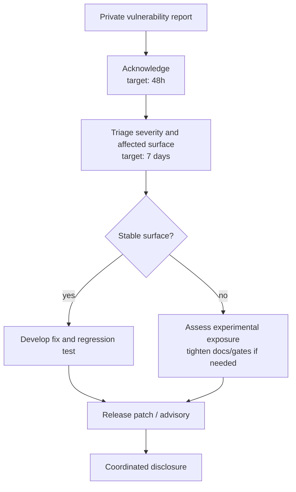
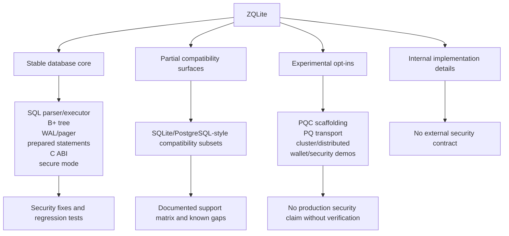
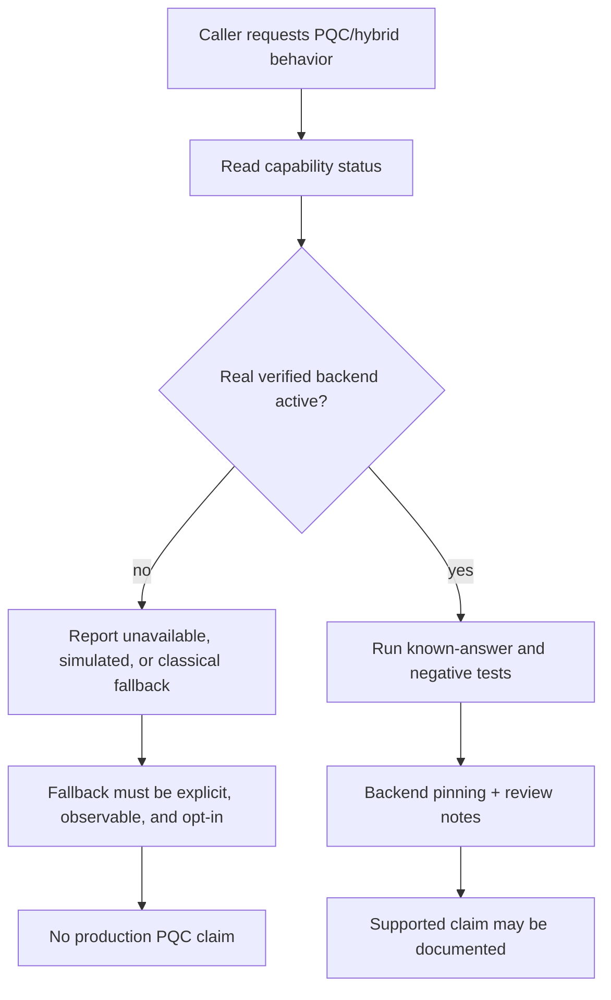
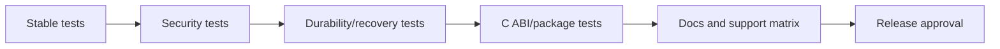

# Security Policy

ZQLite treats the stable embedded database core differently from experimental
crypto, transport, clustering, and PQC scaffolding. Security claims must be tied
to documented behavior, tests, diagnostics, and release artifacts.

## Supported Versions

| Version | Support Status |
|---------|----------------|
| 1.6.x | Active development and security fixes |
| 1.5.x | Security fixes only |
| < 1.5 | Unsupported |

The authoritative package version is declared in [`build.zig.zon`](build.zig.zon).

## Reporting a Vulnerability

Do not open a public GitHub issue for security vulnerabilities.

Use GitHub private vulnerability reporting for this repository. Include:

- affected version, commit, build profile, platform, and Zig version
- short impact summary
- reproduction steps or proof of concept
- whether the issue affects the Zig API, C ABI, CLI, file format, WAL, secure mode, or experimental modules
- crash logs, corrupt database samples, or minimized SQL where relevant
- any suggested fix or mitigation, if available

## Response Process



Response targets:

- Initial acknowledgment: within 48 hours
- Assessment and triage: within 7 days
- Fix development: depends on severity and exploitability
- Coordinated disclosure: after a fix or mitigation is available

## Security Boundary



The stable security boundary includes:

- SQL parsing and execution for the documented support surface
- B+ tree storage, WAL, pager, catalog, and recovery behavior
- in-memory and file-backed database modes
- prepared statements and parameter binding
- stable C ABI functions declared in [`include/zqlite.h`](include/zqlite.h)
- secure mode ATTACH path restrictions
- documented SQLite-style compatibility behavior

The following are not stable production security claims:

- transparent database-at-rest encryption as a complete public feature
- PQ-QUIC or any PQ transport
- ML-KEM / ML-DSA production readiness inside ZQLite unless a real backend is integrated and verified
- cluster manager, distributed query execution, hot standby, or two-phase commit
- wallet, ZKP, or domain-specific security demos

See [`docs/security/stable-vs-experimental.md`](docs/security/stable-vs-experimental.md)
and [`docs/project/stability-policy.md`](docs/project/stability-policy.md).

## PQC Posture

ZQLite currently exposes PQC capability/status reporting and experimental
scaffolding. It must not silently turn fallback or simulated behavior into a
production PQC claim.



Before any PQC path is promoted beyond experimental, it needs:

- deterministic tests for unavailable, simulated, fallback, hybrid-active, and PQC-active states
- known-answer tests for key generation, encapsulation/decapsulation, signing, and verification
- negative tests for corrupt keys, malformed ciphertexts, invalid signatures, and downgrade attempts
- Zig and C capability parity tests
- release-package diagnostics proving what backend is active
- third-party cryptographic review notes

See [`docs/experimental/pqc.md`](docs/experimental/pqc.md).

## Secure Mode

Secure mode provides stricter defaults for ATTACH behavior:

```zig
const conn = try db.Connection.openWithOptions(
    allocator,
    "mydata.db",
    db.ConnectionOptions.SECURE,
);
```

Secure mode enforces:

- absolute-path allowlists for attached databases
- segment-aware root boundary checks
- rejection of path traversal and null bytes
- explicit policy for memory and relative attachments

See [`docs/guides/secure-mode.md`](docs/guides/secure-mode.md).

## Best Practices

Use prepared statements for untrusted input:

```zig
var stmt = try conn.prepare("SELECT * FROM users WHERE id = ?");
try stmt.bind(0, user_id);
```

Configure ATTACH policy explicitly for applications that attach user-controlled
or tenant-controlled database files:

```zig
var conn = try db.Connection.openWithOptions(
    allocator,
    "mydata.db",
    .{
        .attach_policy = .{
            .allowed_roots = &[_][]const u8{ "/var/lib/zqlite" },
            .allow_memory = true,
            .allow_relative = false,
        },
    },
);
```

Treat encryption helpers as building blocks unless a guide explicitly documents a
complete stable workflow. Store keys outside the database, rotate keys according
to your operational policy, and test restore procedures.

## Platform Notes

| Platform | Security posture |
|----------|------------------|
| Linux | Primary supported platform. File-backed database, WAL, and secure-mode paths are tested here first. |
| macOS | Targeted for compilation and file-backed coverage, but not the primary release platform yet. |
| Windows | WAL/pager support is not currently part of the stable supported surface. |

## Release Security Checklist



Before a release that changes security-sensitive behavior:

- run the stable and security validation targets
- add regression tests for fixed vulnerabilities
- update the compatibility and stability docs if the boundary changes
- verify C ABI behavior if the issue crosses the FFI boundary
- document any accepted risk or experimental limitation

Security-relevant changes are recorded in [`CHANGELOG.md`](CHANGELOG.md).
