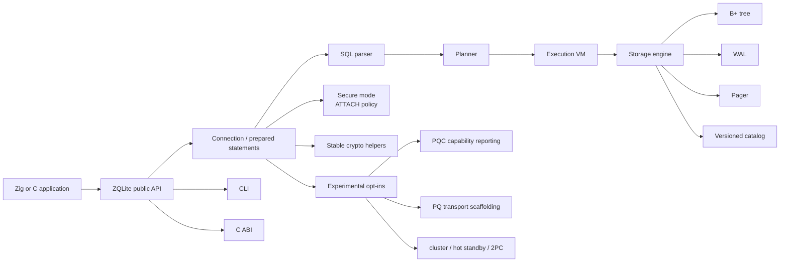
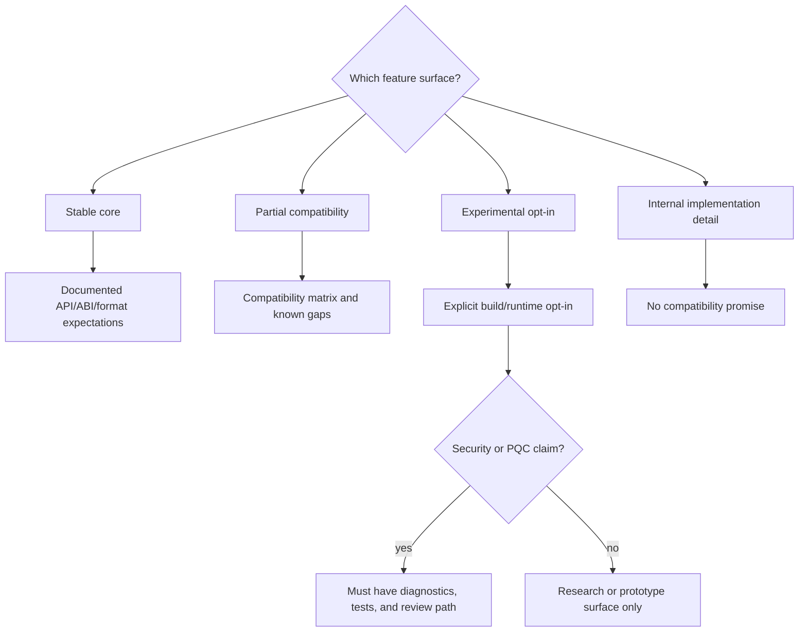

# ZQLite Documentation

ZQLite is an embedded SQL database written in Zig. The documentation is organized
around a stable database core, explicit compatibility boundaries, and clearly
separated experimental security and PQC surfaces.

## Documentation Map

```mermaid
flowchart TD
    start["Start here<br/>docs/README.md"]

    start --> gs["Getting Started"]
    start --> api["API Reference"]
    start --> guides["Guides"]
    start --> compat["Compatibility"]
    start --> security["Security"]
    start --> experimental["Experimental"]
    start --> internals["Internals"]
    start --> project["Project"]

    gs --> install["installation.md"]
    gs --> quick["quickstart.md"]

    api --> zig["zig-api.md"]
    api --> c["c-api.md"]

    guides --> prep["prepared-statements.md"]
    guides --> tx["transactions.md"]
    guides --> durable["durability.md"]
    guides --> secure["secure-mode.md"]
    guides --> encrypt["encryption.md"]

    compat --> sqlite["sqlite.md"]
    compat --> pg["postgresql.md"]
    compat --> matrix["sql-compatibility.md"]

    security --> stable["stable-vs-experimental.md"]
    security --> policy["../SECURITY.md"]

    experimental --> overview["overview.md"]
    experimental --> pqc["pqc.md"]
    experimental --> liboqs["liboqs-backend.md"]

    internals --> arch["architecture.md"]

    project --> release["release-process.md"]
    project --> stability["stability-policy.md"]
    project --> ci["ci-workflow.md"]
    project --> maint["maintainer-workflow.md"]
```



## Runtime Shape



## Stability Flow



## Getting Started

- [Installation](getting-started/installation.md) - Build from source and consume from Zig.
- [Quickstart](getting-started/quickstart.md) - Open a database, create a table, and query rows.

## API Reference

- [Zig API](api/zig-api.md) - Core connection, query, statement, ownership, and error rules.
- [C API](api/c-api.md) - FFI bindings, ABI policy, result access, and ownership rules.

## Guides

- [Prepared Statements](guides/prepared-statements.md) - Positional and named parameter binding.
- [Transactions](guides/transactions.md) - BEGIN, COMMIT, ROLLBACK, SAVEPOINT, and durability notes.
- [Durability](guides/durability.md) - Commit, flush, close, WAL, and persistence-error semantics.
- [Secure Mode](guides/secure-mode.md) - ATTACH path policies and secure connection defaults.
- [Encryption](guides/encryption.md) - Current encryption surfaces and limitations.

## Compatibility

- [SQLite Compatibility](compatibility/sqlite.md) - Supported SQLite-style behavior, deviations, and migration notes.
- [PostgreSQL-Style Features](compatibility/postgresql.md) - PostgreSQL-inspired syntax and explicit non-goals.
- [SQL Compatibility Matrix](sql-compatibility.md) - Machine-generated support matrix from tests.

## Security

- [Stable vs Experimental](security/stable-vs-experimental.md) - Feature maturity and production boundaries.
- [Security Policy](../SECURITY.md) - Vulnerability reporting, support windows, and security posture.

## Experimental Features

- [Experimental Overview](experimental/overview.md) - Experimental database, crypto, transport, and distributed features.
- [Post-Quantum Crypto Status](experimental/pqc.md) - Real, fallback, simulated, and not-production-ready PQC behavior.

## Internals

- [Architecture](internals/architecture.md) - Module graph, query flow, storage flow, build profiles, and security/PQC boundaries.

## Project

- [Release Process](project/release-process.md) - Release checklist and verification flow.
- [Stability Policy](project/stability-policy.md) - API, ABI, on-disk format, and experimental promotion policy.
- [CI Workflow](project/ci-workflow.md) - Local and hosted validation targets.
- [Maintainer Workflow](project/maintainer-workflow.md) - Maintainer release and hygiene process.
- [Performance Evidence](project/performance.md) - Benchmark targets, operational evidence, and non-gating timing policy.

## Quick Links

| Area | Path |
|------|------|
| Package metadata | [`../build.zig.zon`](../build.zig.zon) |
| Build script | [`../build.zig`](../build.zig) |
| Root module | [`../src/zqlite.zig`](../src/zqlite.zig) |
| C header | [`../include/zqlite.h`](../include/zqlite.h) |
| Release notes | [`../CHANGELOG.md`](../CHANGELOG.md) |
| Security policy | [`../SECURITY.md`](../SECURITY.md) |

## Release Validation

```bash
zig build check
zig build test
zig build test-security
zig build test-comprehensive
zig build test-release-package
zig build test-install
./scripts/test-release.sh
```

Full release validation is intentionally heavier than day-to-day CI. Run it on
an idle workstation or CI runner. Release/install scratch space defaults to the
project's normal repo-local `.zig-cache` instead of the system temp tree.

Production claims should be tied to documented behavior, tests, and release
artifacts. Experimental crypto, transport, cluster, and distributed features must
remain explicit opt-ins until they have real implementations and verification.
