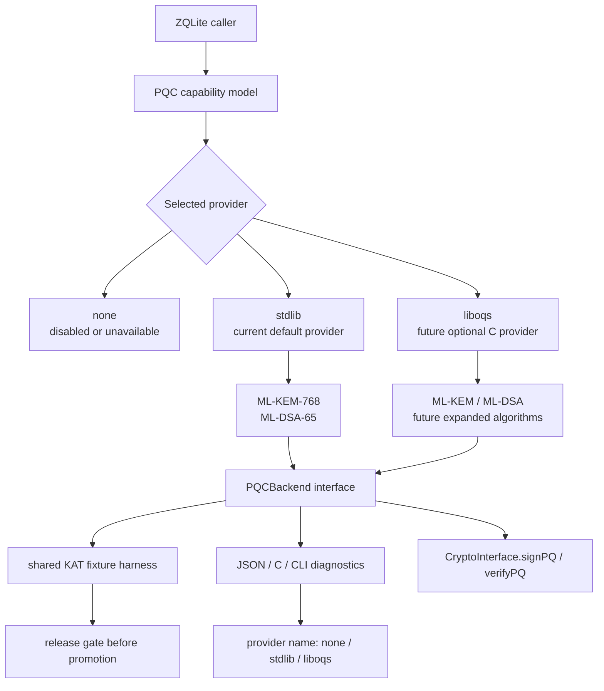

# Future liboqs Backend

ZQLite does not currently link liboqs. The current PQC implementation is a direct Zig stdlib-backed provider for ML-KEM-768 and ML-DSA-65. liboqs is the intended long-term optional C backend once the project needs broader algorithm coverage, upstream vectors, and mature release evidence.

Canonical upstream: https://github.com/open-quantum-safe/liboqs

## Target Architecture

## Why Optional

- Keeps default ZQLite dependency-free and pure Zig.
- Lets embedded users avoid C toolchains unless they explicitly opt in.
- Allows liboqs to be version-pinned and validated separately.
- Prevents experimental PQC work from changing the stable database build contract.

## Integration Rules

- liboqs must stay behind an explicit build option.
- The default provider remains `stdlib` when crypto is compiled and PQC/hybrid mode is requested.
- `CryptoConfig.pq_provider = .liboqs` must fail closed unless liboqs is configured, linked, initialized, and selected.
- `liboqs` must not appear as an active provider until it is actually linked and runtime initialization succeeds.
- Any liboqs backend must pass the same `PQCBackend` KAT fixture harness as the stdlib backend.
- Official known-answer vectors, reproducible release-package tests, and review notes are required before promoting liboqs-backed PQC beyond experimental.

## Provider Selection

ZQLite currently supports three provider preferences:

| Preference | Behavior today |
| --- | --- |
| `auto` | Selects the stdlib provider when crypto is compiled and a real PQC/hybrid mode is requested. |
| `stdlib` | Selects the direct Zig stdlib-backed ML-KEM-768 / ML-DSA-65 provider. |
| `liboqs` | Selects the future liboqs provider, but fails closed today because liboqs is not linked. |

`-Dliboqs=true` is a diagnostic/build intent flag only. It records `configured_but_unlinked` through Zig/C/JSON diagnostics, but it does not add include paths, link liboqs, initialize OQS, or report production readiness.

`-Dliboqs-include-path=...` and `-Dliboqs-library-path=...` are also diagnostic-only today. They are recorded in build options for future detection/linkage work, but no compile or link step consumes them yet.

## Current Code Hooks

| Surface | Current status |
| --- | --- |
| `PQCBackend` interface | Present in `src/crypto/pqc_backend.zig` |
| `StdlibPQCBackend` | Present and tested |
| `LibOQSPQCBackend` | Placeholder only; no link dependency |
| `-Dliboqs=true` | Build-gated flag recorded in build options as `configured_but_unlinked` |
| `-Dliboqs-include-path`, `-Dliboqs-library-path` | Diagnostic-only future linkage inputs; not consumed by the linker |
| Provider diagnostics | JSON/CLI/C capability diagnostics report provider selection and liboqs status |
| KAT harness | Fixture structures and fixture-file loaders can run deterministic ML-KEM/ML-DSA checks through any backend |

## Remaining Before Real Linkage

- Header discovery for `oqs/oqs.h` without making default builds depend on it.
- Library discovery for static and shared liboqs builds across Linux/macOS.
- Explicit include/library build options and failure messages when `-Dliboqs=true` cannot find the requested install.
- Version pinning and minimum supported liboqs version checks.
- Mapping of OQS initialization, allocation, KEM, signature, and cleanup errors into ZQLite error categories.
- Official ML-KEM/ML-DSA KAT vector directories wired into the backend-agnostic fixture loader.
- CI coverage with a pinned liboqs install/cache job plus a no-liboqs default build job.
- C package and Zig package consumer tests proving no accidental link dependency in default builds.
- Security review notes covering algorithm list, randomness assumptions, zeroization, side-channel posture, and release limitations.
