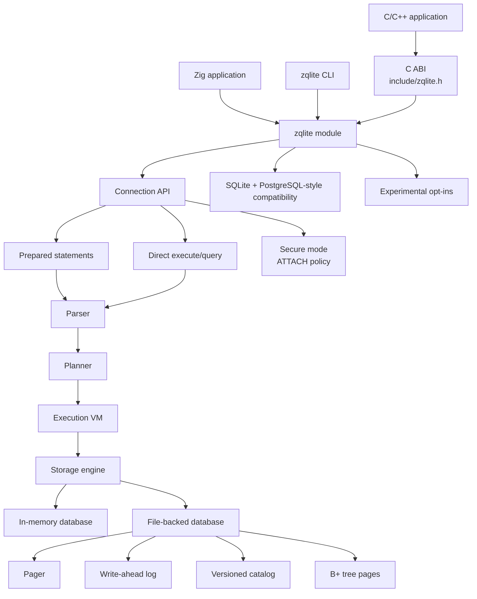
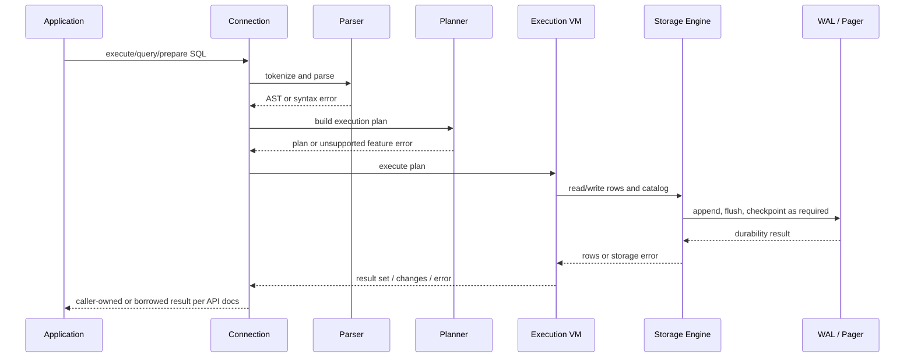
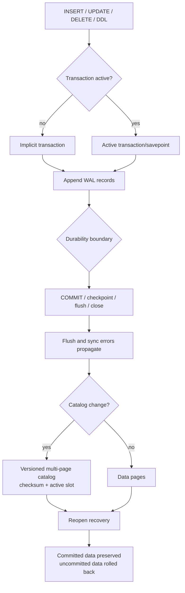
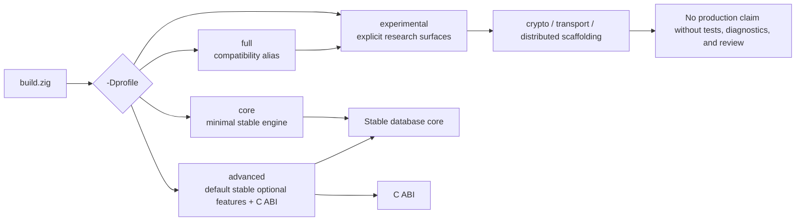
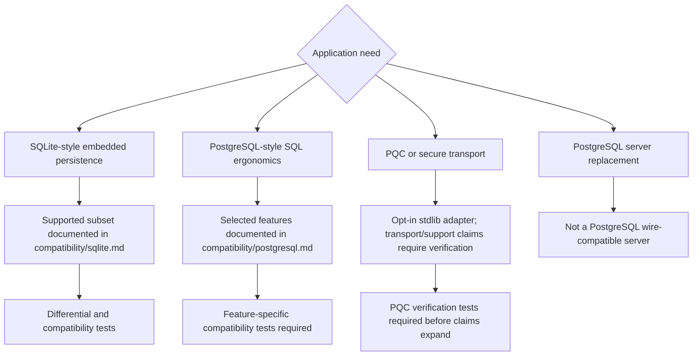
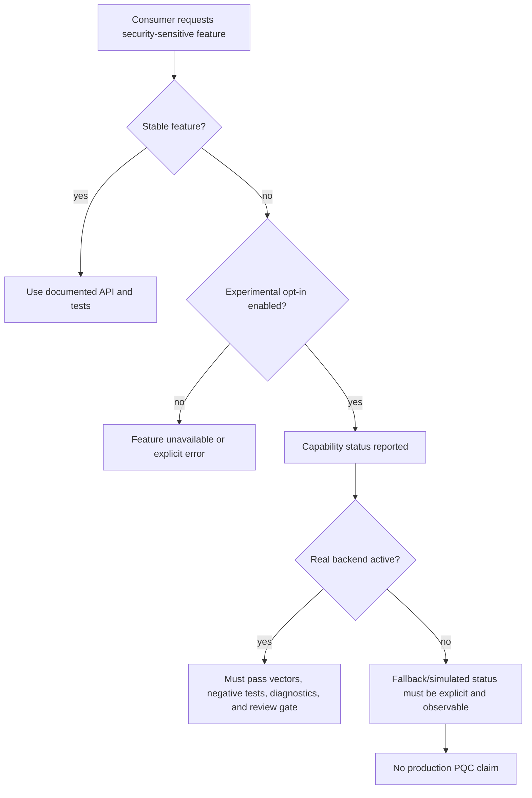

# Architecture

This document describes ZQLite's package structure, query path, persistence
model, build profiles, and security/PQC boundaries.

## High-Level Overview



## Source Layout

```text
src/
├── db/              # Connection, storage, B-tree, WAL, pager, encryption helpers
├── parser/          # Tokenizer, AST, SQL parser
├── executor/        # Planner, VM, functions, prepared statements, window functions
├── ffi/             # Stable C ABI wrapper
├── shell/           # CLI
├── sqlite_compat/   # SQLite-style compatibility helpers
├── crypto/          # Experimental/internal crypto surfaces
├── transport/       # Experimental PQ transport scaffolding
├── concurrent/      # Experimental concurrency, MVCC, hot standby, 2PC work
├── runtime/         # Runtime primitives
└── performance/     # Query cache and cache management
```

## Query Flow



## Persistence Flow



## Build Profiles



## Compatibility Boundary



## Security and PQC Boundary



## Downstream Contract

- Stable Zig APIs document allocator ownership and result lifetimes.
- Stable C ABI functions document borrowed versus caller-owned strings and blobs.
- On-disk format changes require versioning, compatibility policy, and migration or export/import guidance.
- Experimental modules are not part of the stable compatibility promise.
- Security and PQC claims must map to tests, diagnostics, and release artifacts.
