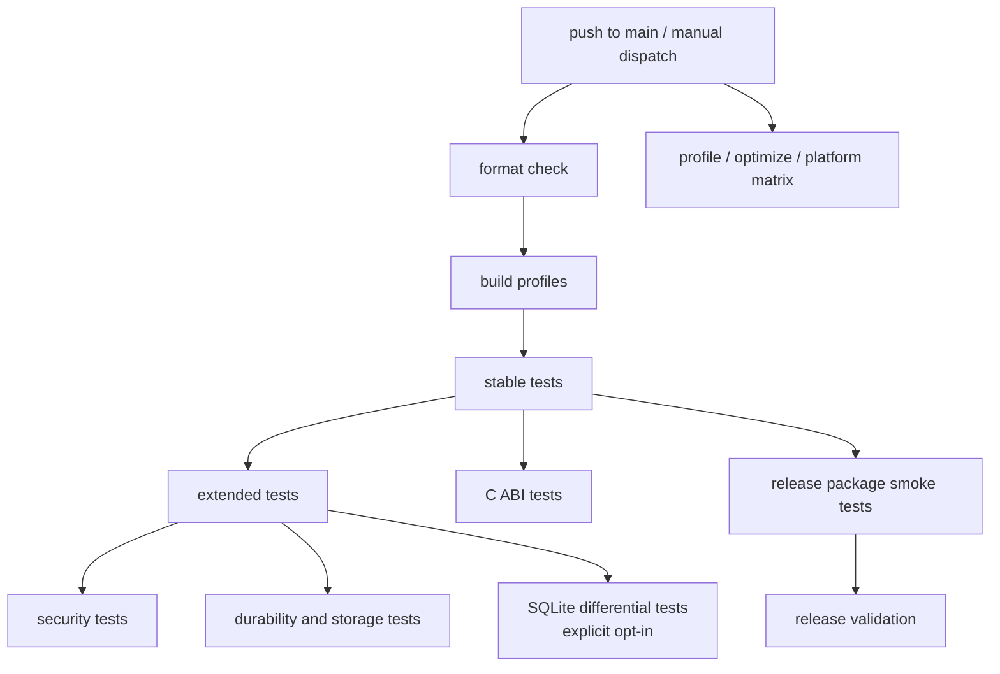
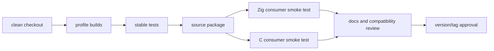

# CI Workflow

This document describes the validation targets that should be used locally and
in hosted CI for ZQLite release work.

## Pipeline Shape



## Core Jobs

| Job | Commands | Purpose |
|-----|----------|---------|
| format | `zig fmt --check src/ examples/ tests/ build.zig` | Keep source formatting deterministic. |
| build | `zig build`, profile builds | Verify advertised build profiles. |
| stable tests | `zig build test`, `zig build check` | Validate the stable database core. |
| security | `zig build test-security` | Validate secure-mode and injection-related behavior. |
| comprehensive | `zig build test-comprehensive` | Run the broader functional suite. |
| storage | storage and durability targets | Validate WAL, catalog, filesystem, and recovery behavior. |
| C ABI | `zig build test-c-api` and release package checks | Validate header, symbols, and external consumers. |
| benchmarks | `zig build bench-validate` | Check benchmark harness and thresholds. |
| coverage | `./scripts/coverage-report.sh` | Generate merged stable-core line coverage and a Cobertura artifact with `kcov`. |
| profile matrix | `zig build test-stable-profiles` | Validate supported profiles and optimized modes. |

## Local Validation

```bash
zig build check
zig build test
zig build test-security
zig build test-comprehensive
zig build test-release-package
zig build test-install
zig build test-stable-profiles
./scripts/test-release.sh
```

## Optional Validation

```bash
zig build test-sqlite-diff
zig build bench-validate
./scripts/coverage-report.sh
docker compose -f docker/docker-compose.yml run --rm zqlite-critical
docker compose -f docker/docker-compose.yml run --rm zqlite-full
docker compose -f docker/docker-compose.yml run --rm zqlite-audit
```

`zig build test-sqlite-diff` requires `sqlite3` on `PATH`.

## Release Gate



Do not update version-number files until the release gate is intentionally
approved.

The hosted workflow lives in [`.github/workflows/ci.yml`](../../.github/workflows/ci.yml) and runs on pushes to `main` or explicit manual dispatch. It covers formatting and repository contracts, builds and unit tests, memory regressions, benchmark validation, extended security/storage/C ABI tests, the profile/optimization matrix, Linux x86_64/aarch64 cross-compilation, and stable-core line coverage. Every job verifies the exact Zig version declared in `build.zig.zon` and uses the repository's Linux x86_64 self-hosted runner. Pull requests do not execute automatically because this public repository must not run untrusted fork code on a persistent self-hosted runner.
